# Quiz Management & Online Assessment Platform — Frontend

A React (Vite + Tailwind CSS) client for the Quiz Management & Online Assessment Platform. Provides separate interfaces for **Students** (browsing/taking quizzes, viewing results, leaderboard) and **Admins** (managing quizzes, questions, students, and analytics).

> This is the **frontend** repository. The companion backend API repository is at: `quiz-platform-backend` (Node.js + Express + PostgreSQL).

---

## Table of Contents

- [Features](#features)
- [Extra Features](#extra-features-beyond-the-original-project-spec)
- [Tech Stack](#tech-stack)
- [Project Structure](#project-structure)
- [Getting Started](#getting-started)
- [Environment Variables](#environment-variables)
- [Available Scripts](#available-scripts)
- [Pages & Routes](#pages--routes)
- [Screenshots](#screenshots)
- [Default Login](#default-login)

---

## Features

### Student Experience
- Register / log in / log out
- Forgot / reset password
- Browse quizzes with search, category filter, difficulty filter, and sort (recent / popularity)
- View quiz details (difficulty, duration, passing score, attempts remaining) before starting
- Take a quiz with:
  - Live countdown timer synced with the backend's authoritative expiry time
  - Question navigator showing answered/unanswered status
  - Support for both single-answer (radio) and multi-select (checkbox) questions
  - A visible negative-marking warning before and during the attempt
- Automatic scoring on submit or on timeout
- Detailed results page with full answer review, correct answers, and explanations
- Attempt history
- Personal dashboard with stats and a score-trend chart
- Leaderboard (overall / monthly / weekly; ranked by average score, highest score, or quizzes completed)

### Admin Experience
- Separate admin login
- Dashboard with platform-wide statistics
- Manage students: search, view profile & quiz history, activate/deactivate, delete
- Manage categories: create, edit, delete
- Manage quizzes: create, edit, delete, publish/unpublish, configure passing score / max attempts / questions-per-attempt
- Manage questions: add/edit/delete, mark single or multiple correct answers, set marks and negative marks, add explanations
- Analytics dashboard with charts: attempts over time, student registrations, most popular quizzes/categories, pass/fail ratio, average score per quiz
- View all attempts platform-wide

---

## Extra Features (Beyond the Original Project Spec)

- **Negative marking indicators** — a visible warning banner is shown on the quiz details page and throughout the quiz-taking screen whenever a quiz uses negative marking, so students know before they guess.
- **Multi-select question UI** — questions requiring more than one correct answer render as checkboxes (instead of radio buttons), with a "Select all that apply" label, and the results/review page correctly highlights all selected vs. correct options.
- **Code-question formatting** — questions containing multi-line code snippets automatically render in a monospace, preserved-whitespace code block instead of plain wrapped text, both while taking the quiz and during review.
- **Per-attempt randomization awareness** — the quiz details page shows "X of Y pool" so students understand that the quiz draws from a larger question bank and may differ between attempts.
- **Configurable questions-per-attempt** in the admin quiz form.
- **Three-tier difficulty filter** (Beginner / Intermediate / Advanced) across all quiz browsing and admin quiz management screens.

---

## Tech Stack

| Layer | Technology |
|---|---|
| Framework | React 18 |
| Build tool | Vite |
| Styling | Tailwind CSS |
| Routing | React Router DOM |
| HTTP client | Axios |
| Charts | Recharts |

---

## Project Structure

```
quiz-platform-frontend/
├── package.json
├── vite.config.js
├── tailwind.config.js
├── postcss.config.js
├── index.html
├── .env
├── .gitignore
├── README.md
└── src/
    ├── main.jsx                # App entry point
    ├── App.jsx                 # Route definitions
    ├── index.css                # Tailwind directives + shared component classes
    ├── api/
    │   └── client.js            # Axios instance with auth token interceptor
    ├── context/
    │   └── AuthContext.jsx      # Session state, login/logout/register
    ├── components/
    │   ├── ProtectedRoute.jsx    # Role-based route guarding
    │   ├── StudentLayout.jsx
    │   ├── StudentNavbar.jsx
    │   └── AdminLayout.jsx
    └── pages/
        ├── auth/
        │   ├── Login.jsx
        │   ├── Register.jsx
        │   ├── ForgotPassword.jsx
        │   ├── ResetPassword.jsx
        │   └── AdminLogin.jsx
        ├── student/
        │   ├── StudentDashboard.jsx
        │   ├── QuizList.jsx
        │   ├── QuizDetails.jsx
        │   ├── QuizAttempt.jsx
        │   ├── QuizResult.jsx
        │   ├── AttemptHistory.jsx
        │   └── Leaderboard.jsx
        └── admin/
            ├── AdminDashboard.jsx
            ├── AdminStudents.jsx
            ├── AdminStudentProfile.jsx
            ├── AdminCategories.jsx
            ├── AdminQuizzes.jsx
            ├── AdminQuizForm.jsx
            ├── AdminQuestions.jsx
            ├── AdminAttempts.jsx
            └── AdminAnalytics.jsx
```

---

## Getting Started

### Prerequisites
- Node.js (v18 or later recommended)
- The backend API running (see the `quiz-platform-backend` repository)

### Installation

```bash
git clone https://github.com/<your-username>/quiz-platform-frontend.git
cd quiz-platform-frontend
npm install
```

### Configure environment variables

```bash
cp .env
```

Then edit `.env` to point at your running backend (see below).

### Run the dev server

```bash
npm run dev
```

The app will be available at `http://localhost:5173`.

**Make sure the backend is running first** (default: `http://localhost:5000`) — this frontend has no functionality without it.

---

## Environment Variables

| Variable | Description | Example |
|---|---|---|
| `VITE_API_URL` | Base URL of the backend API, including `/api` | `http://localhost:5000/api` |

If you change the backend's port, or deploy it somewhere else, update this value and restart the dev server — Vite only reads `.env` at startup.

---

## Available Scripts

| Script | Description |
|---|---|
| `npm run dev` | Start the Vite development server |
| `npm run build` | Build a production bundle into `dist/` |
| `npm run preview` | Preview the production build locally |

---

## Pages & Routes

### Public
| Route | Page |
|---|---|
| `/login` | Student login |
| `/register` | Student registration |
| `/forgot-password` | Request password reset |
| `/reset-password` | Set new password (via emailed link) |
| `/admin/login` | Admin login |

### Student (requires student login)
| Route | Page |
|---|---|
| `/dashboard` | Student dashboard |
| `/quizzes` | Browse quizzes |
| `/quizzes/:id` | Quiz details |
| `/attempt/:attemptId` | Take a quiz (timed) |
| `/results/:attemptId` | Result + answer review |
| `/history` | Attempt history |
| `/leaderboard` | Leaderboard |

### Admin (requires admin login)
| Route | Page |
|---|---|
| `/admin` | Admin dashboard |
| `/admin/students` | Manage students |
| `/admin/students/:id` | Student profile |
| `/admin/categories` | Manage categories |
| `/admin/quizzes` | Manage quizzes |
| `/admin/quizzes/new` | Create quiz |
| `/admin/quizzes/:id/edit` | Edit quiz |
| `/admin/quizzes/:id/questions` | Manage questions |
| `/admin/attempts` | All attempts |
| `/admin/attempts/:attemptId` | View a specific attempt's result |
| `/admin/analytics` | Analytics charts |

---

## Screenshots


| Screenshot | File to add |
|---|---|
| Student login page | `screenshots/login.png` |
| Student registration page | `screenshots/register.png` |
| Admin login page | `screenshots/admin-login.png` |
| Student dashboard with score trend chart | `screenshots/student-dashboard.png` |
| Browse quizzes page (with filters) | `screenshots/quiz-list.png` |
| Quiz details page showing negative marking notice | `screenshots/quiz-details.png` |
| Quiz attempt page — single-answer question | `screenshots/quiz-attempt-single.png` |
| Quiz attempt page — multi-select question | `screenshots/quiz-attempt-multiple.png` |
| Quiz attempt page — code question | `screenshots/quiz-attempt-code.png` |
| Result page with answer review | `screenshots/quiz-result.png` |
| Attempt history page | `screenshots/attempt-history.png` |
| Leaderboard page | `screenshots/leaderboard.png` |
| Admin dashboard | `screenshots/admin-dashboard.png` |
| Admin student management page | `screenshots/admin-students.png` |
| Admin quiz management page | `screenshots/admin-quizzes.png` |
| Admin quiz create/edit form | `screenshots/admin-quiz-form.png` |
| Admin question editor (single vs multiple answer type) | `screenshots/admin-questions.png` |
| Admin analytics page with charts | `screenshots/admin-analytics.png` |

Once added, embed each one like this:

```md
### Student Dashboard

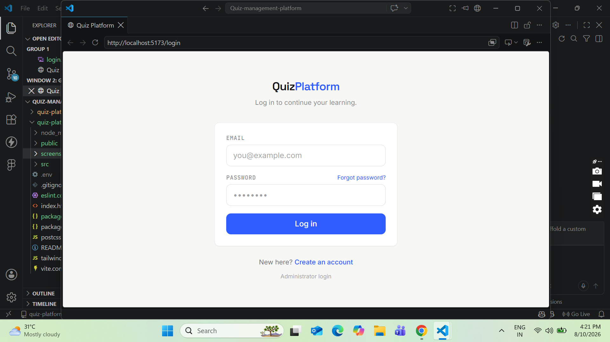
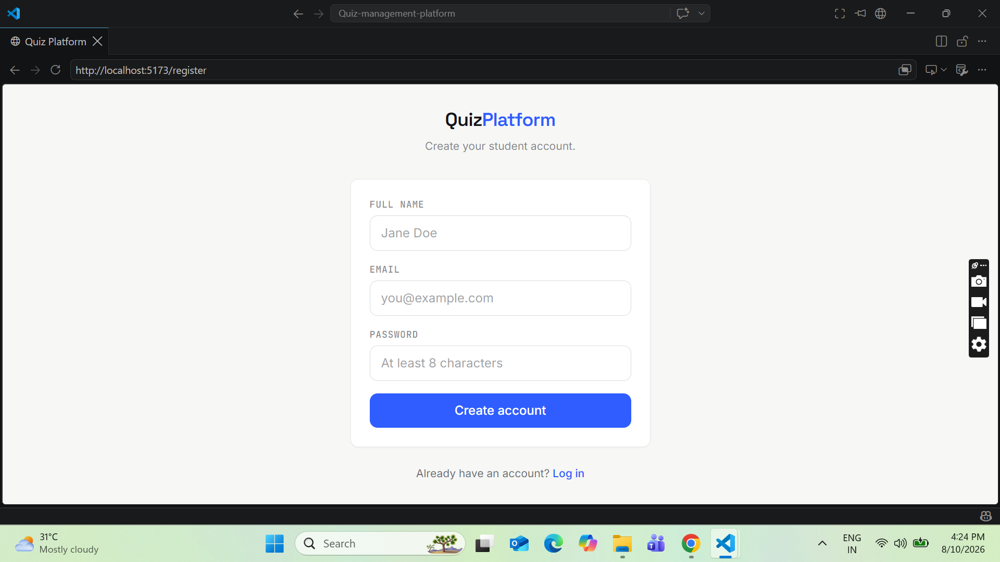
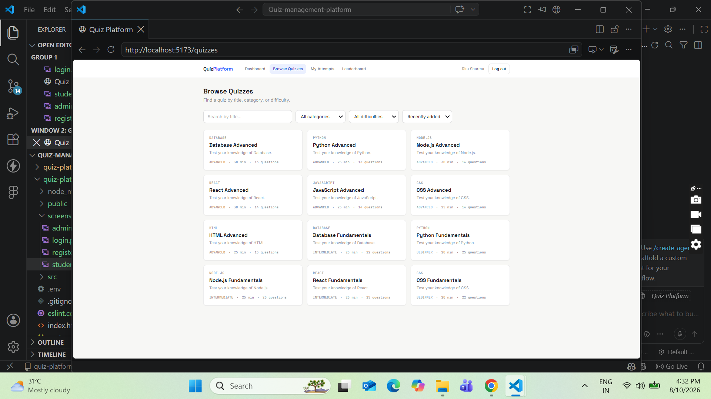
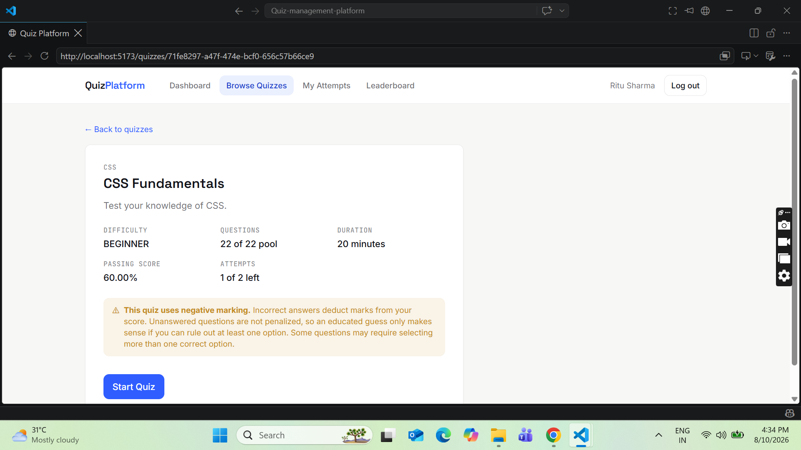
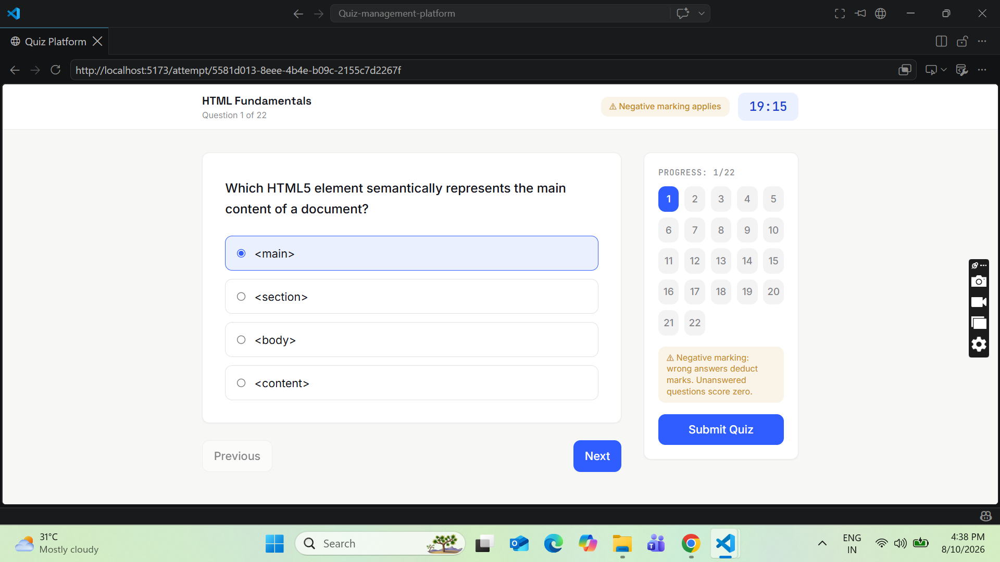
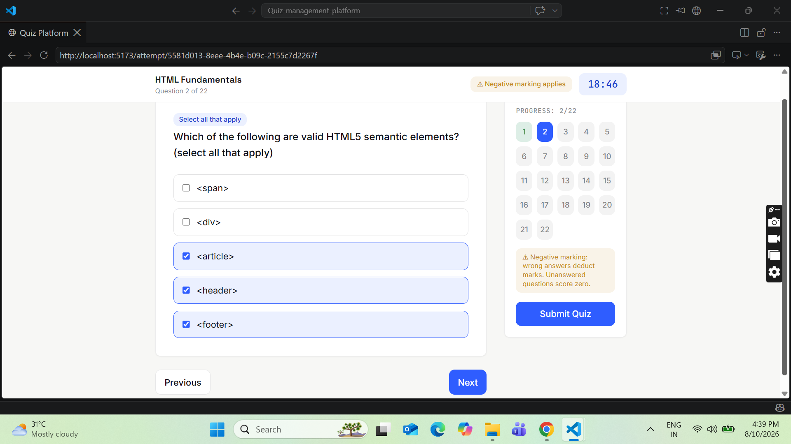
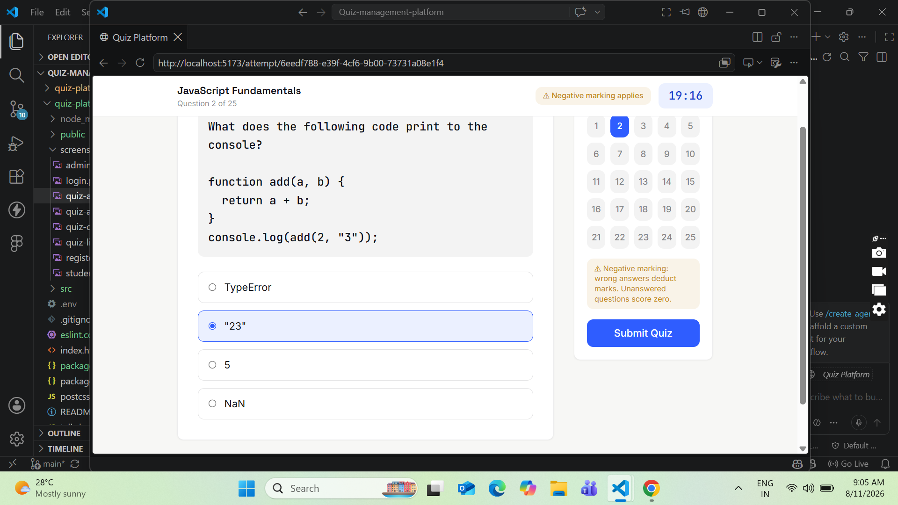
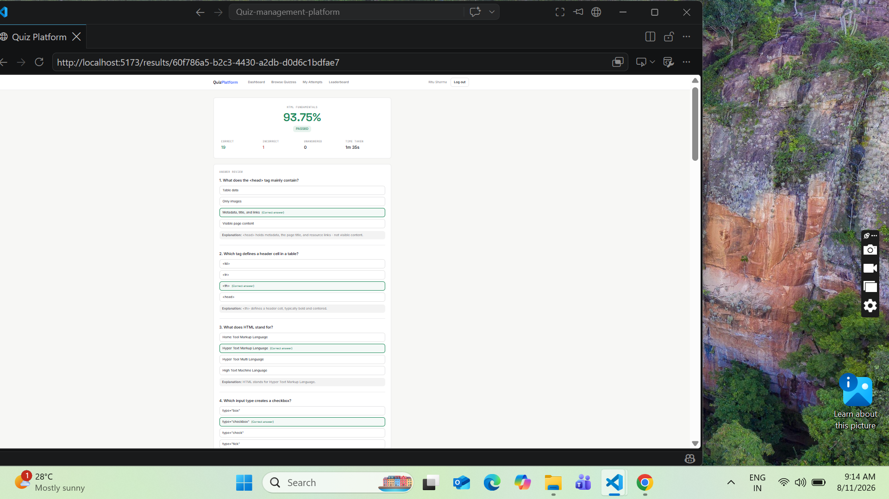
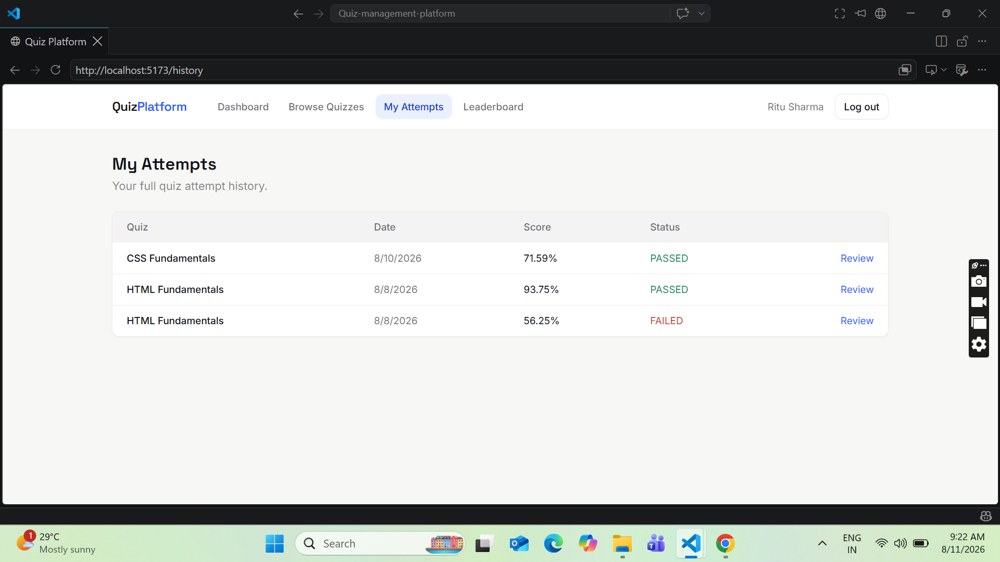
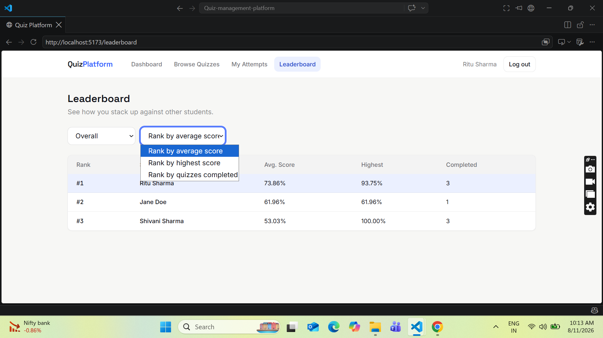


### Admin Dashboard
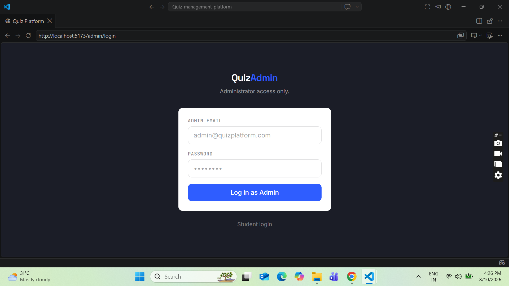
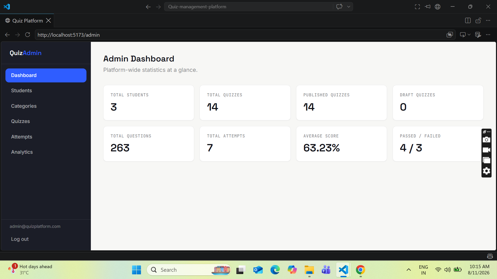
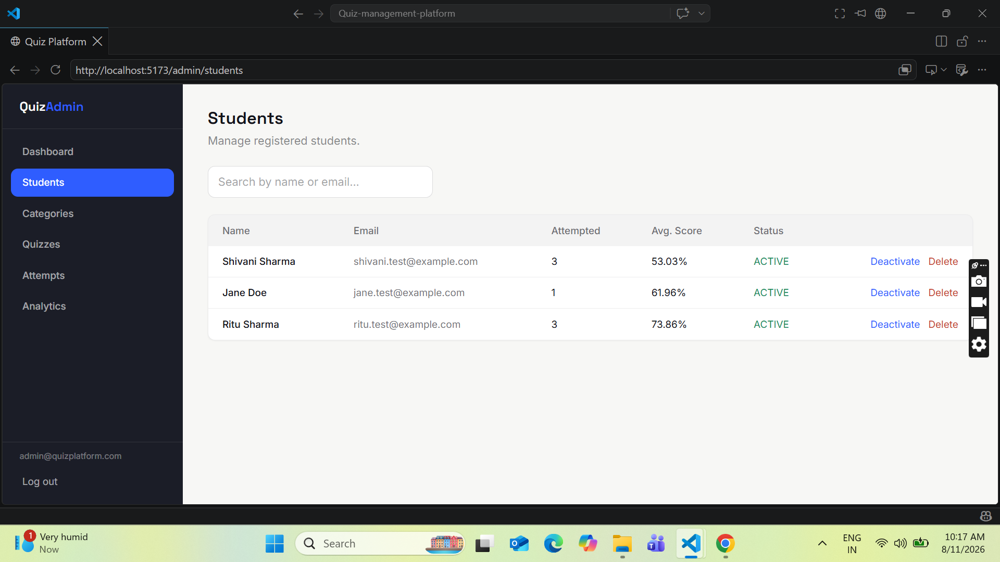
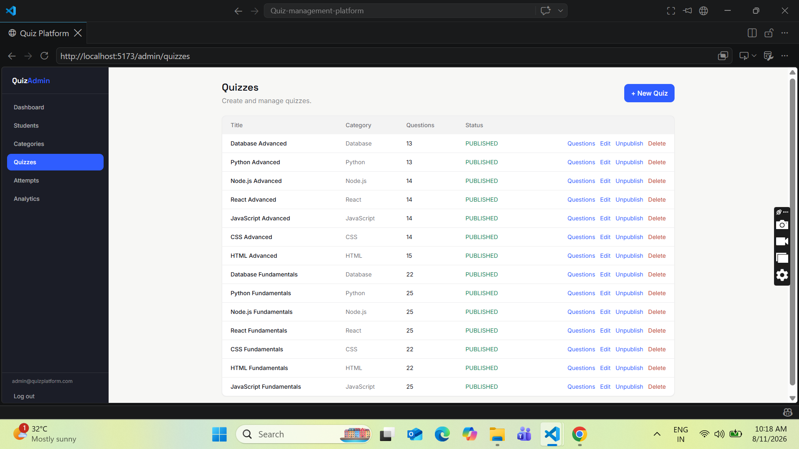
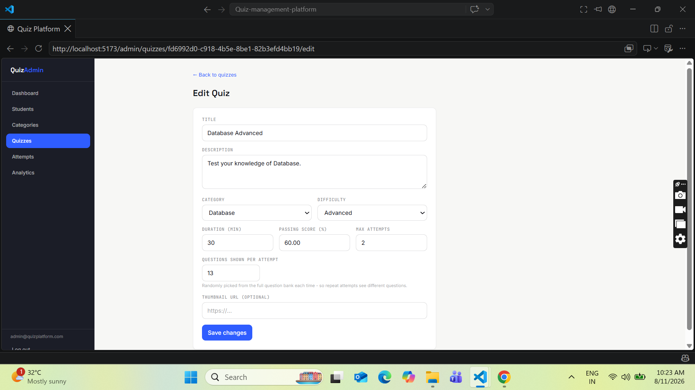
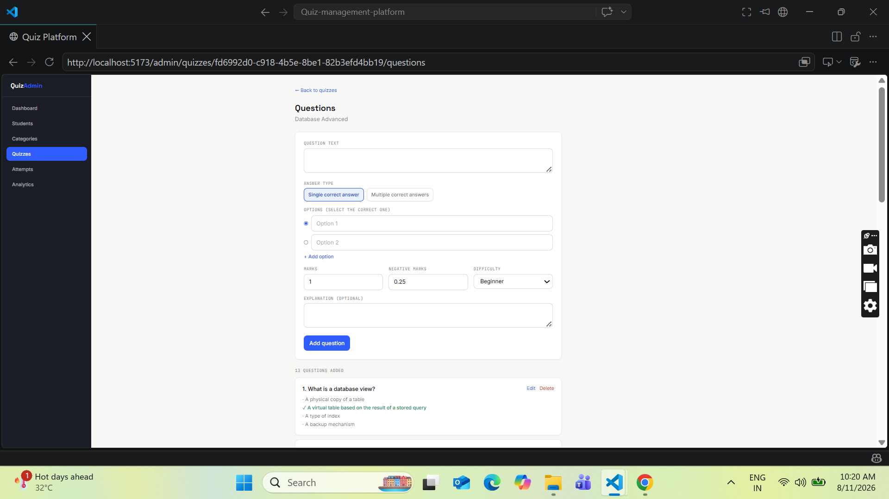
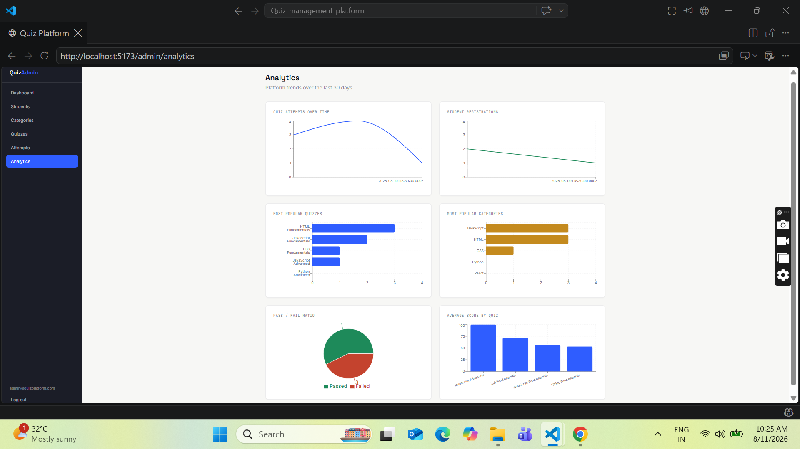
```

To take clean screenshots on Windows: press `Win + Shift + S` to open the Snipping Tool, select the browser window area, then paste (`Ctrl + V`) into Paint and save as `.png` into your repo's `screenshots/` folder.

---

## Default Login

Once the backend has been seeded (`npm run seed` in the backend repo):

```
Admin login (at /admin/login):
  Email: admin@quizplatform.com
  Password: Admin@12345
```

Students register their own account at `/register` — no pre-made student account exists.

---

## Related Repository

Backend API: `quiz-platform-backend` — Node.js + Express + PostgreSQL server this app depends on.

## License

This project was built for educational purposes as part of an internship/training program.